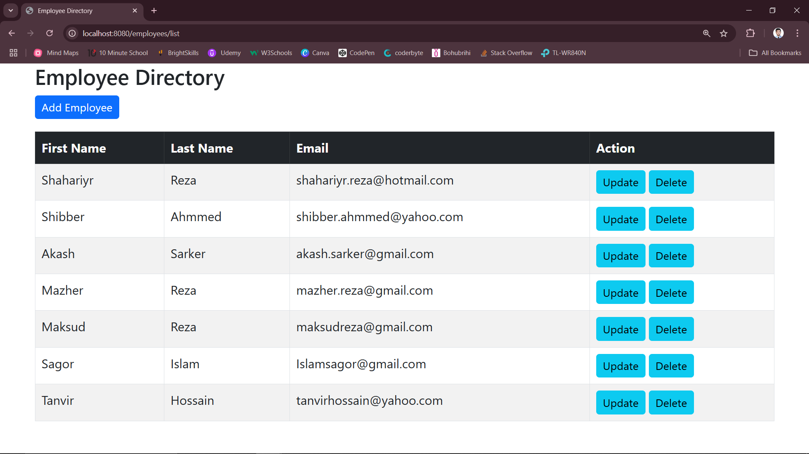
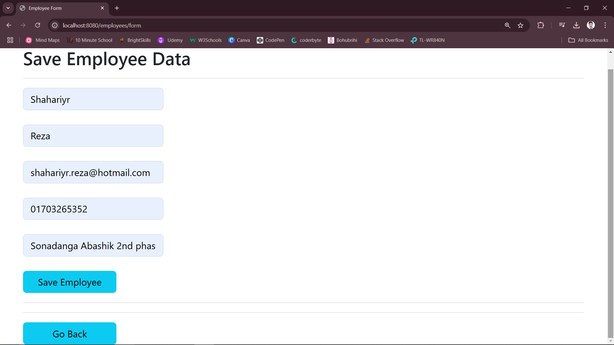
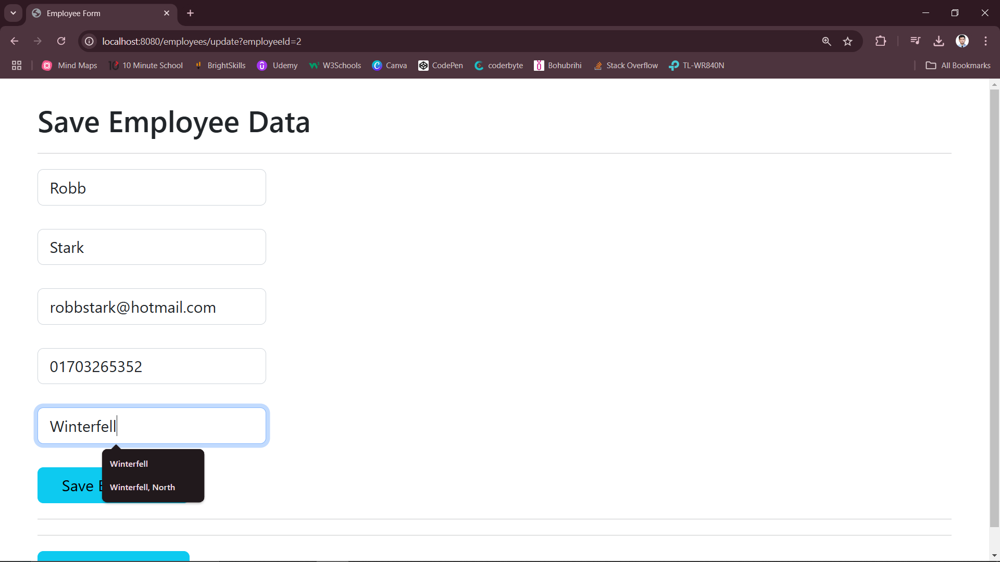
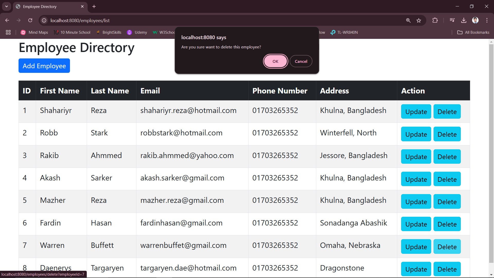

# StaffFlex

StaffFlex is a Java Spring Boot MVC-based **Employee Management System** designed to manage employee records efficiently. This web application enables users to perform **CRUD operations** on employee data, including creating, reading, updating, and deleting employee records.

---

## 🚀 **Key Features**
- **Employee Management:** Manage employee details including First Name, Last Name, and Email.
- **CRUD Operations:** Add, Update, and Delete employee records.
- **Dynamic UI:** User-friendly interface powered by **Thymeleaf** and **Bootstrap**.
- **Responsive Design:** Accessible on various devices with responsive UI elements.

---

## 🛠️ **Technologies Used**
- **Java**
- **Spring Boot**
- **Thymeleaf**
- **Bootstrap**
- **HTML/CSS**
- **MySQL**

---

## 📚 **Project Structure**
```
src/
├── main/
│   ├── java/
│   │   ├── com.staffflex/
│   │   │   ├── controller/
│   │   │   ├── model/
│   │   │   ├── repository/
│   │   │   ├── service/
│   ├── resources/
│   │   ├── templates/
│   │   │   ├── employee/
│   │   ├── static/
│   │   │   ├── css/
│   │   │   ├── js/
│   │   ├── application.properties
└── pom.xml
```

---

## 📂 **Endpoints**
- `GET /employee/list` → Display a list of all employees.
- `GET /employee/form` → Display a form to add a new employee.
- `POST /employee/save` → Save or update employee details.
- `GET /employee/update/{id}` → Update an employee's information.
- `GET /employee/delete/{id}` → Delete an employee record.

---

## ⚙️ **Setup and Installation**

1. **Clone the Repository:**
   ```bash
   git clone https://github.com/your-username/staffFlex.git
   ```

2. **Navigate to Project Directory:**
   ```bash
   cd staffFlex
   ```

3. **Set Up MySQL Database:**
   ```sql
   CREATE DATABASE staffflex_db;
   ```

4. **Configure Database in `application.properties`:**
   ```properties
   spring.datasource.url=jdbc:mysql://localhost:3306/staffflex_db
   spring.datasource.username=root
   spring.datasource.password=your_password
   spring.jpa.hibernate.ddl-auto=update
   ```

5. **Build the Application:**
   ```bash
   mvn clean install
   ```

6. **Run the Application:**
   ```bash
   mvn spring-boot:run
   ```

7. **Access the Application:**
   Open your browser and visit: `http://localhost:8080`

---

## 🖼️ **Screenshots**
### List of Employee

### Save an Employee

### Update an Employee

### Delete an Employee


---

## 🤝 **Contribution**
Contributions are welcome! If you'd like to contribute, please fork the repository and submit a pull request.

---

## 📜 **License**
This project is licensed under the **MIT License**.

---

## 📬 **Contact**
- **Author:** Shahariyr Reza
- **Email:** [shahariyr.reza@hotmail.com](mailto:shahariyr.reza@hotmail.com)
- **GitHub:** [Shahariyr Reza](https://github.com/ShahariyrReza)

---

Thank you for checking out **StaffFlex**! 😊🚀

---

⭐ **If you like this project, give it a star!** ⭐

 
