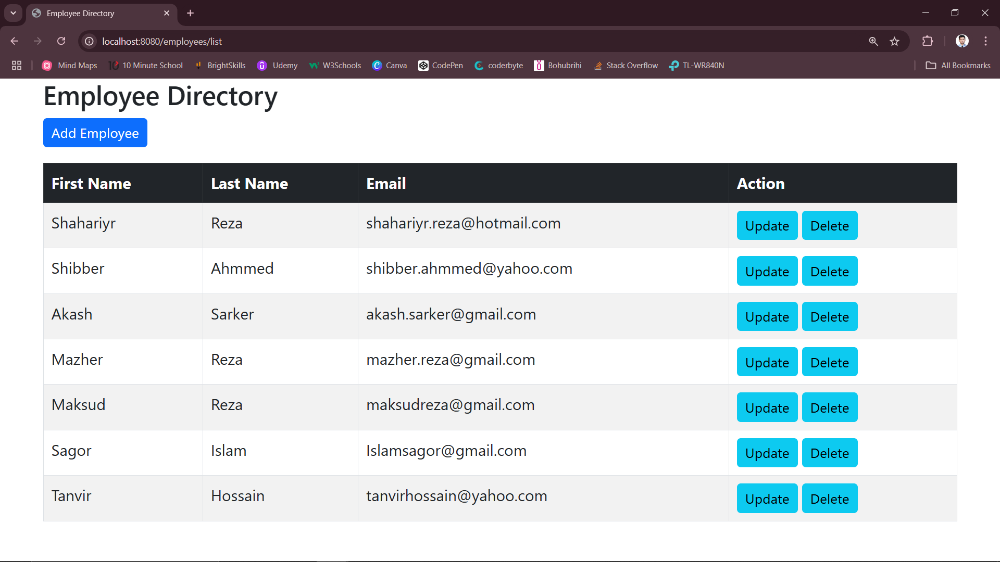

# 👔 StaffFlex - Advanced Employee Management System

StaffFlex is a professional-grade **Employee Management System (EMS)** built with **Java Spring Boot 3.4**. It provides a robust, secure, and scalable RESTful API for handling modern workforce management needs, from attendance tracking to payroll and task assignments.

---

## ✨ Key Features

- 🔐 **Secure Authentication:** Implementation of JWT (JSON Web Token) for stateless authentication.
- 👥 **Comprehensive Employee CRUD:** Manage detailed employee profiles including department and designation.
- 🕒 **Attendance Tracking:** Monitor employee check-ins and check-outs with date-time precision.
- 📋 **Task Management:** Assign tasks to staff members and track their completion status.
- 💰 **Payroll System:** Manage employee salaries and payroll records.
- 🏖️ **Leave Management:** Handle leave requests and approval workflows.
- 🏢 **Organizational Structure:** Manage Departments and Designations (Job Titles) dynamically.
- 🏗️ **Role-Based Access Control (RBAC):** Different permissions for User and Admin roles.
- 📖 **API Documentation:** Interactive API explorer powered by Swagger UI.

---

## 🛠️ Technology Stack

- **Framework:** [Spring Boot 3.4](https://spring.io/projects/spring-boot)
- **Security:** [Spring Security](https://spring.io/projects/spring-security) & [JWT](https://jwt.io/)
- **Database:** [MySQL](https://www.mysql.com/)
- **Persistence:** [Spring Data JPA](https://spring.io/projects/spring-data-jpa) (Hibernate)
- **Mapping:** [ModelMapper](http://modelmapper.org/) & [Lombok](https://projectlombok.org/)
- **API Docs:** [SpringDoc OpenAPI (Swagger)](https://springdoc.org/)
- **Build Tool:** Maven

---

## 📂 Project Structure

```text
src/main/java/com/shahariyr/StaffFlex/
├── config/       # Security and App configurations
├── controller/   # REST Controllers (API Endpoints)
├── dto/          # Data Transfer Objects
├── entity/       # JPA Entities (Database Tables)
├── enums/        # Project Enums (Role types, Status etc.)
├── exception/    # Custom Exception Handlers
├── repository/   # Spring Data JPA Repositories
├── security/     # JWT & Security Implementation
└── service/      # Business Logic Layer
```

---

## 🚀 Getting Started

### Prerequisites
- **Java 17** or higher
- **Maven 3.x**
- **MySQL Server**

### Setup & Installation

1. **Clone the Repository:**
   ```bash
   git clone https://github.com/ShahariyrReza/StaffFlex.git
   cd StaffFlex
   ```

2. **Database Configuration:**
   Create a database named `employee_directory` in MySQL:
   ```sql
   CREATE DATABASE employee_directory;
   ```

3. **Configure `application.properties`:**
   Open `src/main/resources/application.properties` and update your database credentials:
   ```properties
   spring.datasource.url=jdbc:mysql://localhost:3300/employee_directory
   spring.datasource.username=your_username
   spring.datasource.password=your_password
   ```

4. **Build and Run:**
   ```bash
   mvn clean install
   mvn spring-boot:run
   ```

5. **Access API Documentation:**
   Once running, explore the APIs at: [http://localhost:8080/swagger-ui/index.html](http://localhost:8080/swagger-ui/index.html)

---

## 🛣️ API Endpoints Summary

| Method | Endpoint | Description |
| :--- | :--- | :--- |
| `POST` | `/api/auth/register` | User Registration |
| `POST` | `/api/auth/login` | User Login (Returns JWT) |
| `GET` | `/api/employees` | List all employees |
| `POST` | `/api/employees` | Add new employee |
| `GET` | `/api/employees/{id}` | Get employee details |
| `PUT` | `/api/employees/{id}` | Update employee info |
| `DELETE` | `/api/employees/{id}` | Remove employee |
| `POST` | `/api/attendance` | Record attendance |
| `GET` | `/api/attendance` | View attendance records |

---

## 🖼️ Screenshots

*(Add your high-quality screenshots here)*

### Dashboard / Employee List


### API Explorer (Swagger)


---

## 🤝 Contributing

Contributions are what make the open-source community such an amazing place to learn, inspire, and create. Any contributions you make are **greatly appreciated**.

1. Fork the Project
2. Create your Feature Branch (`git checkout -b feature/AmazingFeature`)
3. Commit your Changes (`git commit -m 'Add some AmazingFeature'`)
4. Push to the Branch (`git push origin feature/AmazingFeature`)
5. Open a Pull Request

---

## 📜 License

Distributed under the MIT License. See `LICENSE` for more information.

---

## 📬 Contact

- **Shahariyr Reza** - [shahariyr.reza@hotmail.com](mailto:shahariyr.reza@hotmail.com)
- **GitHub:** [https://github.com/ShahariyrReza](https://github.com/ShahariyrReza)

---
⭐ **If you find this project useful, please give it a star!** ⭐
